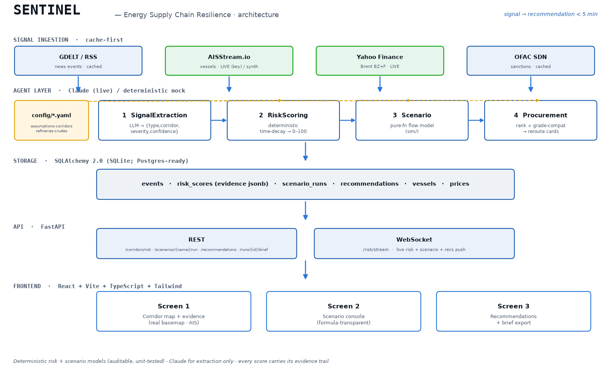
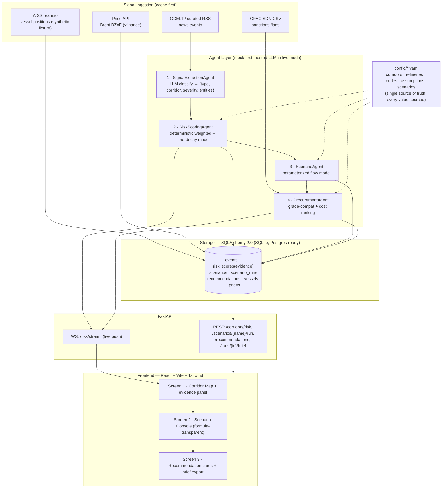
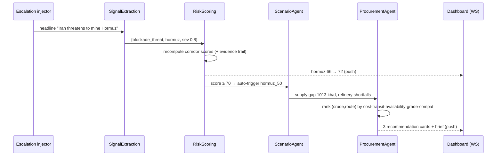

# Sentinel — Architecture

**Crisis-to-decision engine for India's crude oil supply chain.**
Signal → risk score → scenario → executable procurement recommendation, in
under 5 minutes, entirely from cached data for the demo.

## System diagram

## The pipeline (one loop)

## Key design decisions

| Concern | Decision | Why |
|---|---|---|
| Risk model | Deterministic weighted time-decay, **not** ML | Auditable; every score carries its evidence trail |
| Scenario math | Pure functions in `sim/`, coefficients in `assumptions.yaml` | Transparent, unit-tested against hand-computed values |
| LLM role | Extraction/classification only (mock-first) | Runs offline; no black-box decisions |
| Grade compatibility | Deterministic API°/sulfur window check | Executable, explainable procurement — not a vibe |
| DB | SQLite (SQLAlchemy 2.0, Postgres-ready) | Zero-dependency offline demo |
| Map | Self-contained SVG projection | No tile server → fully offline |

## Design choices & tradeoffs

Chosen to keep the offline demo reliable within the hackathon timebox; each is a
one-line swap back to the heavier "production" choice:

- **Postgres + pgvector → SQLite + in-process cosine.** `DATABASE_URL` swaps the
  engine; procurement RAG uses a small in-memory ranking instead of pgvector.
- **LangGraph → explicit `agents/pipeline.py`.** Same discrete nodes + strict
  schemas + mock mode, less dependency surface, more readable for judges.
- **deck.gl → hand-rolled SVG map.** No external tiles; renders offline.
- **Alembic migrations → `Base.metadata.create_all` at startup/seed.** Fine for
  a single-node demo; Alembic slot is left open in the layout.
